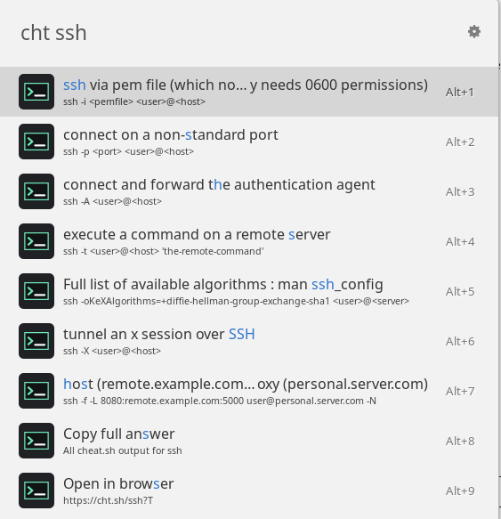

# cheat.sh for Ulauncher

Search [cheat.sh](https://cht.sh/) from Ulauncher and copy practical command examples without leaving the launcher.

Type `cht <query>`, pick the task you want, and press Enter to copy the command.



## Features

- Search cheat.sh with the default `cht` keyword.
- Shows command-focused results instead of raw cheat.sh output.
- Press Enter on a result to copy that specific command.
- Includes lower-priority actions to copy the full cheat.sh answer or open it in your browser.
- Uses only Python standard-library modules plus Ulauncher's extension API.

## Examples

```text
cht tar
cht docker
cht python list comprehension
cht python/random list elements
cht ~snapshot
```

Example result for `cht tar`:

```text
extract an uncompressed archive
tar -xvf /path/to/foo.tar

create a .tgz or .tar.gz archive
tar -czvf /path/to/foo.tgz /path/to/foo/
```

## Installation

### From Ulauncher Extensions

After this extension is published, install it from:

```text
https://ext.ulauncher.io/-/github-aradar46-ulauncher-cheatsh
```

### From GitHub URL

Open Ulauncher Preferences, go to Extensions, choose **Add extension**, and paste this repository URL:

```text
https://github.com/aradar46/ulauncher-cheatsh
```

This is the same URL you can paste into Ulauncher's **Add extension** dialog.

### Local Development Install

Ulauncher loads local extensions from:

```bash
~/.local/share/ulauncher/extensions/
```

Symlink this project while developing:

```bash
mkdir -p ~/.local/share/ulauncher/extensions
ln -s "$PWD" ~/.local/share/ulauncher/extensions/ulauncher-cheatsh
```

Restart Ulauncher, then try:

```text
cht tar
```

## Development

Run the helper tests:

```bash
python -m unittest discover -s tests
```

Run Ulauncher with verbose logging:

```bash
ulauncher -v
```

For the extension development workflow recommended by Ulauncher:

```bash
ulauncher --no-extensions --dev -v
```

## How It Works

The extension calls cheat.sh directly over HTTPS:

```text
https://cht.sh/<query>?T
```

Spaces are encoded as `+`, and slash-separated cheat.sh namespaces are preserved. For example:

```text
cht python/random list elements
```

queries:

```text
https://cht.sh/python/random+list+elements?T
```

The `?T` flag asks cheat.sh for plain text output. The extension also strips terminal escape sequences defensively.

## Publishing Notes

The repository root must contain:

- `main.py`
- `manifest.json`
- `versions.json`
- `images/icon.svg`
- `README.md`

`versions.json` points to `master`, which is kept as the publishing branch for Ulauncher compatibility.

## Limitations

- Requires network access to `https://cht.sh`.
- No offline cache is currently implemented.
- cheat.sh content is provided by the upstream cheat.sh service; this extension only formats and exposes it in Ulauncher.
